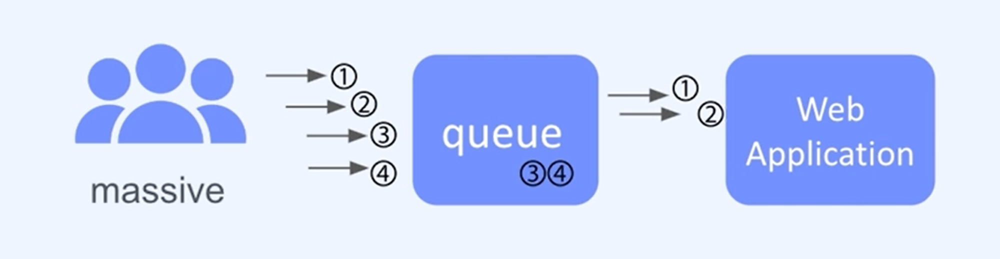
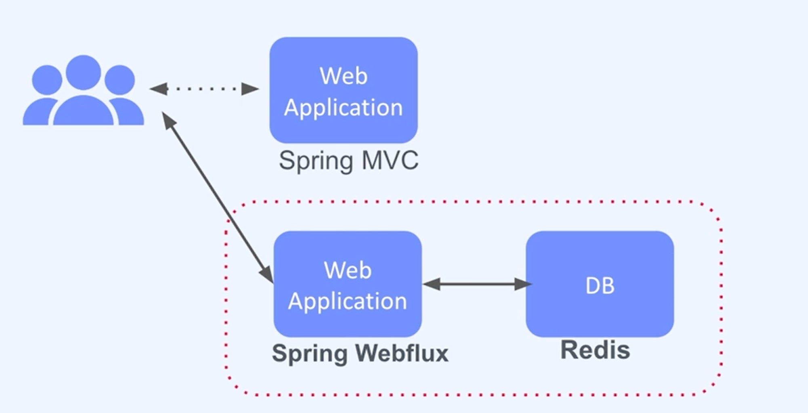
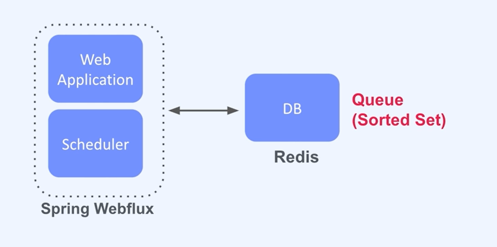
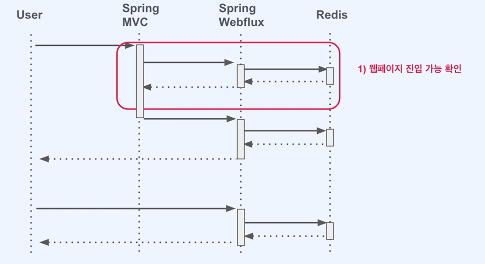
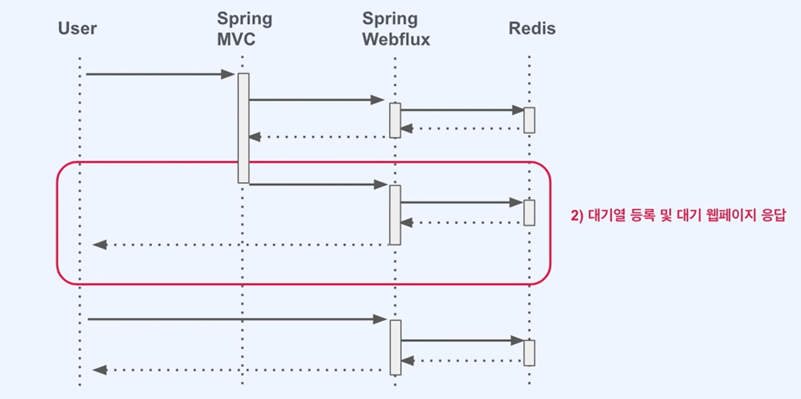
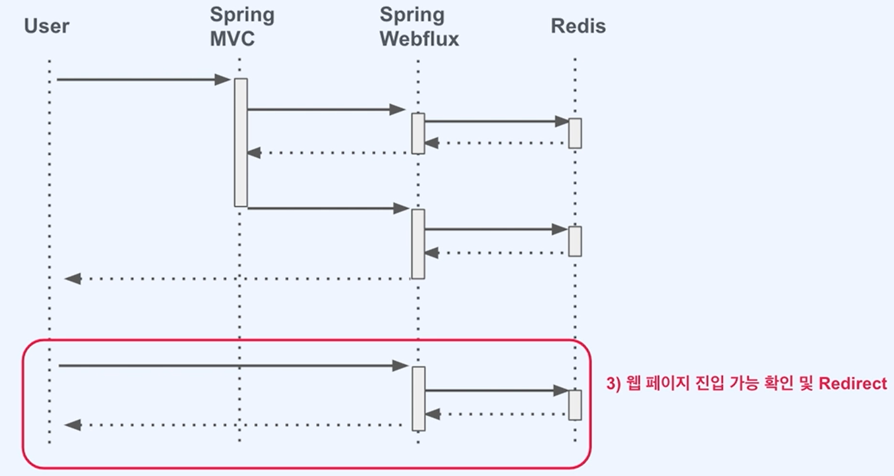

# 접속자 대기열 시스템

이 프로젝트는 대량의 사용자 트래픽을 효과적으로 관리하기 위한 대기열 시스템을 제공합니다. Redis의 Sorted Set과 Spring WebFlux를 사용하여 백엔드를 과부하시키지 않고 사용자가 순차적으로 웹 애플리케이션에 입장할 수 있도록 합니다.

---

## 🔧 주요 기능

- **대기열 관리**: Redis의 Sorted Set을 사용하여 사용자 순서를 관리하고, 대기열에 있는 사용자를 순차적으로 입장시킵니다.
- **Reactive 처리**: Spring WebFlux를 통해 비동기적으로 대기열 상태를 관리하여 서버 자원을 효율적으로 사용합니다.
- **Redis 연동**: Redis와 비동기 통신을 통해 사용자 데이터를 빠르고 안정적으로 처리합니다.

---

## 🛠️ 사용 라이브러리

- **webflux**
- **redis-reactive**
- **thymeleaf**
- **embedded-redis**
  

---

## 📦 설치 목록

- **Java 17**
- **Docker**
- **Redis - Docker Image**


```bash
docker pull redis:6.2

docker run --rm -it -d -p 6379:6379 redis:6.2
```

---

## 🗂️ 시스템 구성

### 1. 대기열 시스템 구조

사용자는 먼저 대기열에 진입한 후, 순차적으로 웹 애플리케이션에 접근할 수 있습니다. 대기열 시스템은 다수의 사용자를 관리하며, 각각의 사용자는 요청 순서에 따라 처리됩니다.



---

### 2. Spring MVC와 WebFlux 통합

아래 다이어그램은 Spring MVC와 Spring WebFlux를 결합하여 대기열을 관리하는 구조를 보여줍니다. Spring WebFlux를 통해 Redis와 비동기적으로 상호작용하여 대기열을 처리하며, 사용자가 웹 애플리케이션에 진입할 수 있도록 합니다.



---

### 3. 대기열 처리 흐름

이 시스템은 Redis의 Sorted Set을 활용하여 사용자가 진입 시 `wait` 키에 데이터를 넣고, 시간이 지나면 `proceed` 키에 데이터를 이동시켜 사용자에게 입장을 허용하는 방식으로 처리됩니다.



---

### 4. 대기열에서 사용자 처리 순서

다음 시퀀스 다이어그램은 사용자가 대기열에 등록되고, 대기 시간이 끝난 후에 입장할 수 있는 과정을 보여줍니다.

### 1) 사용자가 웹 페이지에 진입할 수 있는지 확인



### 2) 대기열 등록 및 대기 웹 페이지 응답



### 3) 웹 페이지 진입 가능 확인 및 리다이렉트



---